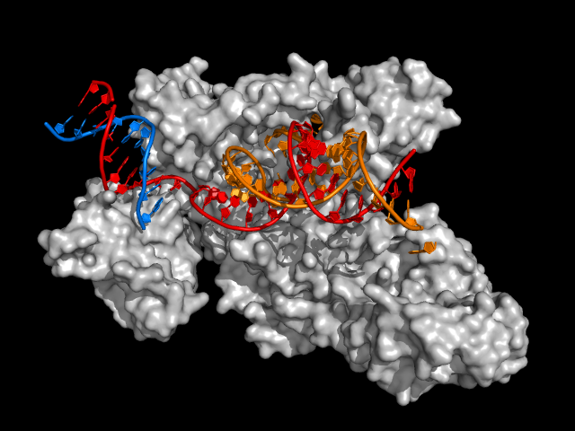
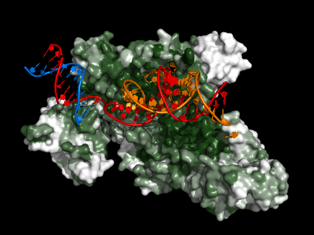

# ConSurf Pymol Colorizer 

Takes the `consurf.grades` file from [ConSurf](http://consurf.tau.ac.il/2016/) and colors each amino acid in the reference protein according to its degree of conservation. Darker green residues are more highly conserved. Amino acids with insufficient data are colored as if they're not conserved at all. 

### Usage

Put the `consurf.grades` file in the same directory that you run Pymol from. 

Then in the Pymol command line prompt, enter:

`run consurfcolor.py`

### Before

### After

